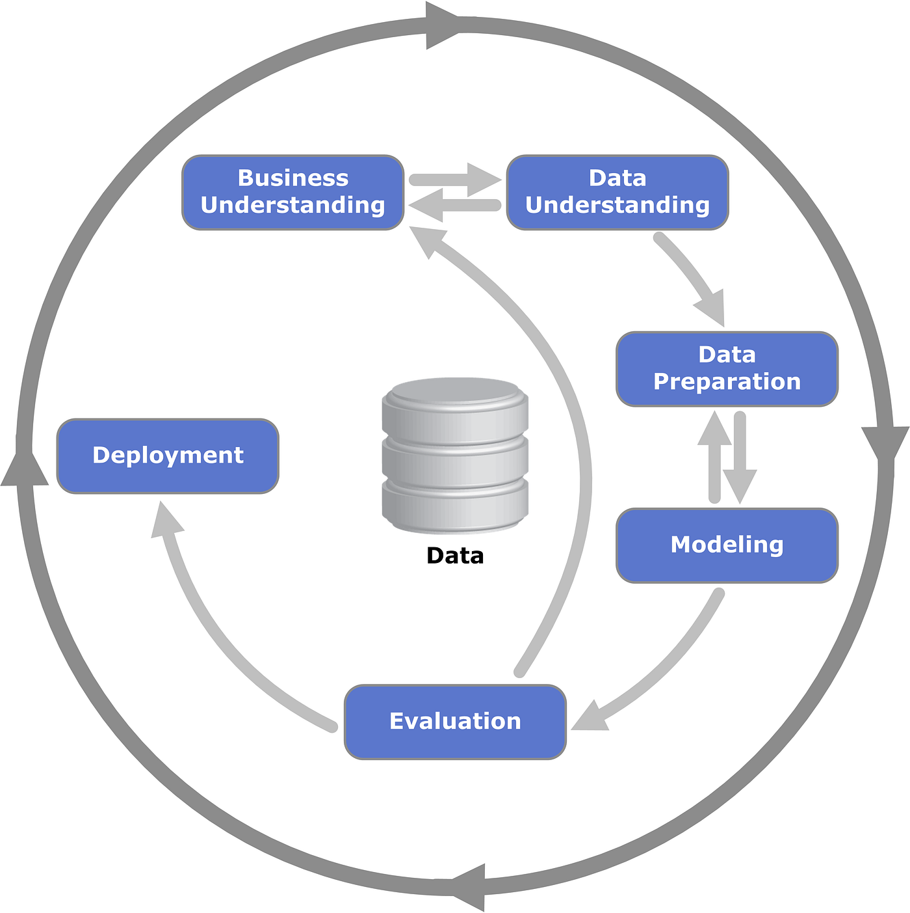

# Projet Fil Rouge --- Système de Prédiction de Churn Télécom

Projet réalisé dans le cadre du **Master 1 Data-IA --- Concepts et
Technologies IA**.

Ce projet consiste à concevoir un **système complet de prédiction du
churn client** dans le secteur des télécommunications, couvrant **tout
le cycle de vie d'un projet Machine Learning**, depuis l'analyse des
données jusqu'au **déploiement d'un modèle en production avec une API et
une approche MLOps**.

------------------------------------------------------------------------

# Objectif du Projet

Dans le secteur des télécommunications, **acquérir un nouveau client
coûte 5 à 7 fois plus cher que conserver un client existant**.

L'entreprise fictive **TelecomPro** possède :

-   **7000+ clients**
-   **26.5% de churn annuel**
-   pertes financières importantes

L'objectif est de développer un **modèle prédictif capable d'identifier
les clients à risque de départ** afin de déclencher des **actions
marketing ciblées**.

------------------------------------------------------------------------

# Utilsation de la méthodologie CRISP-DM

## Le projet suit la méthodologie **CRISP-DM** :

1.  Business Understanding\
2.  Data Understanding\
3.  Data Preparation\
4.  Modeling\
5.  Evaluation\
6.  Deployment

------------------------------------------------------------------------

# Contraintes Business

Le système doit respecter plusieurs contraintes :

-   **Recall ≥ 75%**
-   **API temps réel (\<200ms par prédiction)**
-   **Explicabilité des prédictions (SHAP)**
-   **Monitoring des performances et détection de drift**
-   **Possibilité d'A/B testing entre modèles**

------------------------------------------------------------------------

# Dataset

**Source : Kaggle --- Telecom Churn Prediction**

### Caractéristiques

-   7043 observations
-   21 variables
-   1 variable cible : `Churn`
-   20 features clients

Répartition :

  Classe     Proportion
  ---------- ------------
  No Churn   73.5%
  Churn      26.5%

------------------------------------------------------------------------

# Exploration des Données

L'analyse exploratoire permet :

-   d'identifier les corrélations avec le churn
-   d'analyser les distributions des variables
-   de détecter les anomalies et valeurs manquantes
-   de comprendre les profils clients à risque

------------------------------------------------------------------------

# Feature Engineering

Création de nouvelles variables pour améliorer les performances du
modèle.

### Exemples

**Ratios**

AverageMonthlySpend = TotalCharges / tenure

**Agrégations**

-   nombre total de services
-   score d'engagement client

**Interactions**

Contract × InternetService

------------------------------------------------------------------------

# Modélisation

Plusieurs algorithmes ont été comparés :

-   Logistic Regression
-   Decision Tree
-   Random Forest
-   XGBoost / LightGBM
-   Support Vector Machine
-   KNN

### Métriques utilisées

-   Accuracy
-   Precision
-   Recall
-   F1-score
-   ROC-AUC

------------------------------------------------------------------------

# Gestion du Déséquilibre

Méthodes testées :

-   `class_weight='balanced'`
-   SMOTE
-   Undersampling
-   Hybrid sampling

------------------------------------------------------------------------

# Optimisation

Optimisation des hyperparamètres avec :

-   GridSearchCV
-   RandomizedSearchCV

Exemple :

    param_grid = {
    'n_estimators':[100,200,500],
    'max_depth':[10,20,30]
    }

------------------------------------------------------------------------

# Explicabilité

Le modèle est interprété avec :

-   Feature Importance
-   Permutation Importance
-   SHAP Values

Visualisations :

-   SHAP summary plot
-   Force plot
-   Waterfall plot

------------------------------------------------------------------------

# Déploiement

Le modèle est exposé via une **API REST**.

Technologies :

-   FastAPI / Flask
-   Docker
-   MLflow

------------------------------------------------------------------------

# API

### Health Check

GET /health

### Prédiction

POST /predict/single

### Batch

POST /predict/batch

------------------------------------------------------------------------

# Docker

Build :

docker build -t churn-api .

Run :

docker run -p 5000:5000 churn-api

------------------------------------------------------------------------

# Monitoring

Détection de dérive avec **Population Stability Index**.

PSI = Σ (actual - expected) × ln(actual/expected)

------------------------------------------------------------------------

# Architecture

project_churn/

data/\
notebooks/\
src/\
api/\
models/\
tests/\
Dockerfile\
docker-compose.yml

------------------------------------------------------------------------

# Stack Technique

-   Python
-   Pandas
-   Scikit-learn
-   XGBoost
-   SHAP
-   FastAPI / Flask
-   Docker
-   MLflow

------------------------------------------------------------------------

# Conclusion

Ce projet illustre un **workflow complet de Machine Learning en
production** :

-   exploration des données
-   feature engineering
-   comparaison de modèles
-   optimisation
-   explicabilité
-   déploiement API
-   monitoring MLOps

